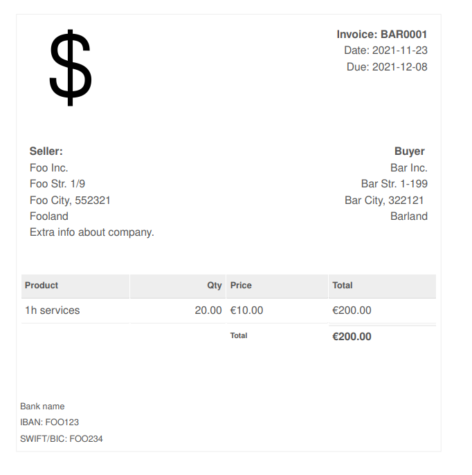

invoicepy
=========


**CLI** invoice tool, store and print invoices as *pdf*. save companies and
customers for later use.


installation
------------

``` {.sourceCode .bash}
poetry install
poetry shell
```

for now ...

config
------

[config](src/invoicepy/schema/config.json) stores `companies` and `customers` by alias and [invoices](src/invoicepy/schema/invoice.json).
`custom_templates_dir` is available for customising templates.

write [sample config](src/invoicepy/config/sample_config.json) with:
``` {.sourceCode .bash}
invoicepy sample-config
# then customize it in $HOME/.invoicepy.conf
```

examples
-------------

1. print pdf saving it in current directory, result is invoice nr. BAR001
``` {.sourceCode .bash}
invoicepy pdf --company foo --customer bar --line '{"price":10, "qty": 20, "name":"1h services"}' --series BAR
```


when above is repeated twice, the invoices numers will increase, BAR002, BAR003. this is calculated per series.
see below for more options.

2. below example won't save invoice in config, open in in browser and use custom template specified in `custom_templates_dir`:
```
invoicepy pdf --company foo --customer bar --line ... -b --no-save --series BAR --number 25 --curency USD --template my_custom_template.html
```

cli
---

``` {.sourceCode .}
invoicepy [OPTIONS] COMMAND [ARGS]...

Options:
  -C, --config PATH
  --help             Show this message and exit.

Commands:
sample-config        generate sample config in home dir
pdf                  prints pdf to given path
```

**pdf**

```
Options:
  -l, --line TEXT       json string of invoice line, can pass multiple. ex:
                        --line '{"price":15, "qty": 100, "name":"1h cleaning
                        services", "vat": 21}' --line ...  [required]

			The fields are as follows:
			`price` - price of product
			`qty` - quantity of product
			`name` - name of product
			`vat` - vat rate %


  -c, --company TEXT    company alias as in configuration.  [required]
  -r, --customer TEXT   customer alias as in configuration.  [required]
  -d, --date TEXT       invoice date, `create_date` field.
  -e, --due-date TEXT   If due date is not provided, `payment_term_days` is
                        used to calculate it.

  -s, --series TEXT     invoice series  [required]
  -n, --number INTEGER  invoice number, if not provided, it will calculated
                        from company config for given series.

  -u, --currency TEXT   currency, default=EUR
  -o, --output PATH     output path, can be new filepath, directory. If it's
                        not provided the invoice pdf will be saved in current
                        directory.

  -t, --template TEXT   template name, ex. simple.html. `custom_templates_dir`
                        will be searched first, then package templates.

  --save / --no-save    decides whether to store invoice in config file.
  -b, --browser         open generated invoice in browser.
  --help                show this message and exit.
```

templates
---------
currently two templates are available:
- `simple.html` - simple english template (*default*).
- `simple_lt.html` - simple lithuanian/english template.

you can pass your own template name with `-t`. see `custom_templates_dir` (config section). have a look on schema below in case you want to write your own templates. templates are written in html and use [jinja2](https://jinja.palletsprojects.com/en/3.0.x/) templating language.

schema
------
-   [schema/invoice.json](src/invoicepy/schema/invoice.json)
-   [schema/config.json](src/invoicepy/schema/config.json)


contributing
-------------

if you written cool new template or improved some features, feel free to fork and PR. See [contributing guidelines](CONTRIBUTING.md).

to-dos
-------------

-   use babel for translations and locale
-   extend tests
-   consider moving config to yaml
-   backup copy config on start
-   invoices should have unique ids (maybe companies and customers too?)
-   view saved invoices
-   reprint saved invoices (?)
-   package for arch (AUR)

Credits
-------

This package was created with
[Cookiecutter](https://github.com/audreyr/cookiecutter) and the
[johanvergeer/cookiecutter-poetry](https://github.com/johanvergeer/cookiecutter-poetry)
project template.

Template taken from here and slightly modified:
<https://github.com/sparksuite/simple-html-invoice-template>

Licence
-------

Free software: MIT license
